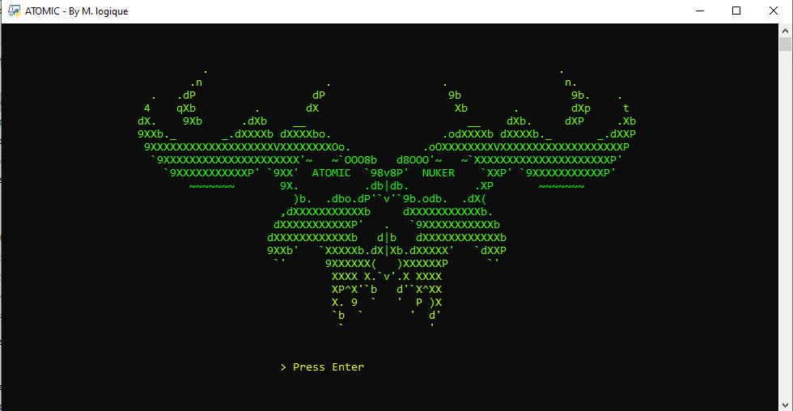
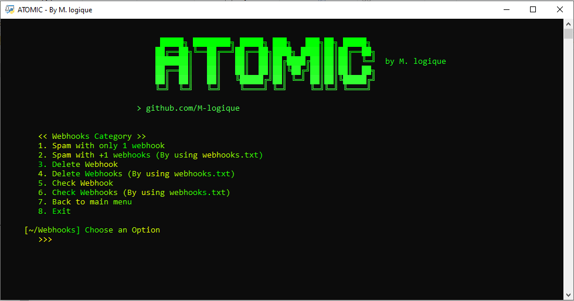
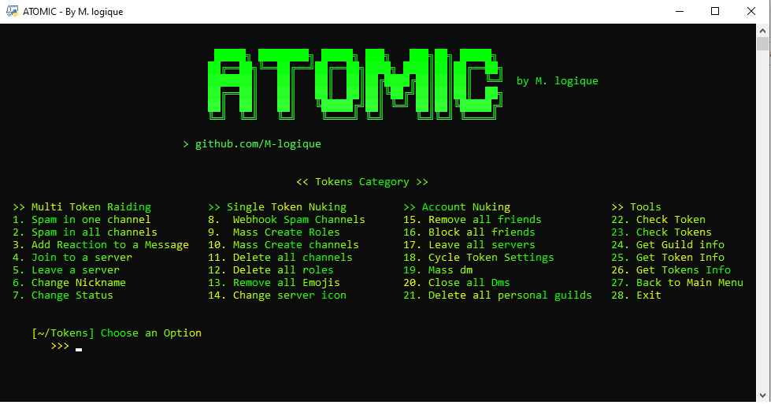

# ☣︎ ATOMIC Tool ☣︎



## 🕶 ATOMIC Tool is a professional attacking tool that support abnormal options like:

- Multi webhook spammer
- Multi webhook deleter
- Multi token information scrapper
- Professional Token Checker
- Fast Multi Token raider
- Discord Token Nuker
# Installation 

🔗 Clone the repo by using this link
```bash
git clone https://github.com/M-logique/Atomic
```

♦ Open the project in your teminal
```bash
cd Atomic
```

⚡ Install Python packages by using pip
```bash
pip install -r requirements.txt
```

✨ Now Enjoy!
```bash
python main.py
```

# ⚡ Features 

## 🔗 Webhook Tools

<br>

## 💊 Token Tools


<br>


**✨ And More!**

# ⚠ Disclaimer
**Using this Tool means violating Discord's Terms of policy, and the owner of this Tool _does not_ take any responsibility for any thing.**